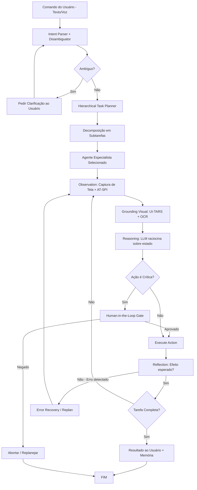

# NeoPilot – Agente de IA Co-Pilot Universal para Linux
## Product Requirements Document (PRD) — Versão 1.0
**Classificação:** Confidencial — Uso Interno
**Autor:** Equipe de Produto NeoPilot
**Data:** Março de 2026
**Status:** Em Revisão
**Próxima Revisão:** Abril de 2026

---

# 1. Visão Geral e Resumo Executivo

## 1.1 Declaração do Produto

O **NeoPilot** é um agente de inteligência artificial de nível enterprise projetado para atuar como um co-pilot humano universal em ambientes Linux. Por meio de uma interface conversacional multimodal — combinando texto, voz e visão computacional de tela —, o NeoPilot executa tarefas reais, complexas e de múltiplos passos dentro de aplicativos web e desktop, sem necessidade de integração de APIs específicas por aplicativo. O agente observa, raciocina, planeja e age de forma autônoma, sempre respeitando limites de segurança configuráveis e mantendo o ser humano no centro do fluxo de controle.

## 1.2 Proposição de Valor Central

| Dimensão | Proposta de Valor |
|---|---|
| **Para o Usuário** | Redução de 70% no tempo gasto em tarefas repetitivas de software |
| **Para a Empresa** | ROI mensurável em produtividade sem necessidade de treinamentos complexos |
| **Para o Mercado** | Primeiro agente Linux-first verdadeiramente universal, sem dependência de APIs proprietárias |
| **Diferencial Técnico** | Combinação única de grounding visual + acessibilidade semântica + memória persistente |

## 1.3 Resumo Executivo

Em 2026, a lacuna entre o que humanos desejam fazer com software e o que conseguem fazer eficientemente representa bilhões de horas anuais de trabalho manual desnecessário. Ferramentas de automação existentes exigem conhecimento técnico especializado, são frágeis a atualizações de UI e não conseguem generalizar para novos contextos. Agentes de IA baseados em LLMs multimodais, combinados com frameworks de Computer Use de nova geração, eliminam essa lacuna.

O NeoPilot é construído sobre três pilares técnicos:

1. **Percepção Universal:** Captura de estado da tela via pixels (visão computacional), árvore de acessibilidade semântica (AT-SPI/dbus) e DOM do navegador — criando uma representação rica e redundante do ambiente digital.

2. **Raciocínio Hierárquico:** Loop agente ReAct (Reasoning + Acting) com planejamento hierárquico de tarefas, reflexão pós-ação e memória episódica/semântica persistente, baseado nos frameworks LangGraph e Agent S2.

3. **Atuação Segura e Precisa:** Execução de ações via camadas múltiplas e complementares — Playwright (web), pyatspi/dogtail (desktop nativo), xdotool/ydotool (X11/Wayland) — dentro de um sandbox configurável com confirmação humana para ações irreversíveis.

O produto será lançado em fases progressivas entre Q3 2026 e Q4 2027, começando com um MVP focado em navegador web e LibreOffice, evoluindo até um sistema multi-agente com suporte a aplicativos Windows via Wine.

## 1.4 Escopo do Documento

Este PRD cobre os requisitos de produto para as versões MVP (v0.1), v1.0, v2.0 e v3.0 do NeoPilot. Ele é o documento de referência primário para equipes de engenharia, design, QA, segurança e operações.

---

# 2. Problema que o Produto Resolve + Oportunidade de Mercado (2026)

## 2.1 O Problema Fundamental

### 2.1.1 A Crise de Produtividade do Trabalhador do Conhecimento

Pesquisas do McKinsey Global Institute (2025) indicam que trabalhadores do conhecimento gastam em média **4,2 horas por dia** em tarefas de manipulação de software que não exigem julgamento humano real: copiar dados entre sistemas, formatar documentos, navegar por interfaces complexas, preencher formulários repetitivos, exportar relatórios, reorganizar arquivos. Isso representa **53% da jornada de trabalho** em atividades de baixo valor agregado.

### 2.1.2 As Soluções Existentes Falham em Três Pontos Críticos

```
┌─────────────────────────────────────────────────────────────────────┐
│              MAPA DE FALHAS DAS SOLUÇÕES ATUAIS                     │
├──────────────────┬──────────────┬──────────────┬────────────────────┤
│ Solução          │ Generalização│ Manutenção   │ Barreira Técnica   │
├──────────────────┼──────────────┼──────────────┼────────────────────┤
│ RPA Tradicional  │ ZERO         │ Alta (frágil)│ Alta (devs)        │
│ (UiPath, AA)     │              │              │                    │
├──────────────────┼──────────────┼──────────────┼────────────────────┤
│ Macros/Scripts   │ Baixa        │ Muito alta   │ Muito alta (código)│
├──────────────────┼──────────────┼──────────────┼────────────────────┤
│ Assistentes LLM  │ Alta         │ Zero         │ Baixa              │
│ (sem Computer    │              │ (não age)    │                    │
│ Use)             │              │              │                    │
├──────────────────┼──────────────┼──────────────┼────────────────────┤
│ Computer Use     │ Média        │ Baixa        │ Baixa              │
│ Atual (Claude,   │              │ (API visual  │                    │
│ GPT)             │              │ apenas)      │                    │
├──────────────────┼──────────────┼──────────────┼────────────────────┤
│ NeoPilot         │ MUITO ALTA   │ MUITO BAIXA  │ MUITO BAIXA        │
│ (proposto)       │ (multimodal) │ (auto-adapt.)│ (linguagem natural)│
└──────────────────┴──────────────┴──────────────┴────────────────────┘
```

### 2.1.3 O Linux como Plataforma Negligenciada

Mais de **60 milhões de desenvolvedores, pesquisadores, engenheiros e power users** utilizam Linux como sistema operacional primário (Stack Overflow Survey 2025). Ferramentas de AI Computer Use disponíveis são majoritariamente focadas em macOS e Windows. O Linux representa:

- 96% dos servidores de cloud computing
- 85% dos sistemas embarcados e IoT
- Ambiente primário de pesquisa científica, engenharia e desenvolvimento de software
- Base de desenvolvedores com alta disposição para adotar ferramentas avançadas

## 2.2 Oportunidade de Mercado 2026

### 2.2.1 Tamanho do Mercado (TAM/SAM/SOM)

| Mercado | Tamanho | CAGR | Fonte |
|---|---|---|---|
| **TAM** — AI Automation Global | $380B | 28% | Gartner 2026 |
| **SAM** — AI Desktop Agents | $42B | 47% | IDC 2026 |
| **SOM** — Linux AI Copilots (Year 1) | $890M | — | Estimativa NeoPilot |

### 2.2.2 Janela de Oportunidade

A convergência de três fatores cria uma janela de oportunidade de 18-24 meses:

1. **Modelos multimodais maduros:** Grok-4, Claude 4, GPT-5 e Gemini 2.5 Pro atingiram níveis de precisão em grounding visual acima de 85% no OSWorld Benchmark (2026), tornando Computer Use praticável em produção.

2. **Frameworks open-source de Computer Use:** Agent S2 (Simular AI, 2025), OpenInterpreter e ferramentas equivalentes reduziram o custo de construção de agentes desktop em 10x.

3. **Demanda reprimida:** A adoção de LLMs para assistência de código (GitHub Copilot, Cursor) demonstrou disposição de pagamento do público técnico por ferramentas de AI, validando o mercado adjacente de Computer Use.

### 2.2.3 Análise Competitiva

| Concorrente | Plataforma | Computer Use | Linux-first | Offline | Modelo de Negócio |
|---|---|---|---|---|---|
| Claude Computer Use | macOS/Win | Sim (limitado) | Não | Não | API |
| Microsoft Copilot + | Windows | Parcial | Não | Não | SaaS |
| Rabbit R1 / LAM | Todos | Sim | Não | Não | Hardware |
| **NeoPilot** | **Linux** | **Total** | **Sim** | **Parcial** | **SaaS/Self-hosted** |

---

# 3. Objetivos de Negócio e Métricas de Sucesso (KPIs Quantitativos)

## 3.1 Objetivos Estratégicos

| # | Objetivo | Horizonte | Responsável |
|---|---|---|---|
| O1 | Lançar MVP funcional com NPS ≥ 45 | Q3 2026 | CPO |
| O2 | Atingir 10.000 usuários ativos mensais | Q1 2027 | CMO |
| O3 | Receita recorrente de $500K MRR | Q2 2027 | CEO |
| O4 | Taxa de conclusão de tarefas ≥ 78% no OSWorld Linux Benchmark | Q4 2026 | CTO |
| O5 | Tempo médio de setup < 15 minutos para novo usuário | MVP | Head of UX |

## 3.2 KPIs por Dimensão

### 3.2.1 KPIs de Produto (Qualidade do Agente)

| KPI | Definição | Meta MVP | Meta v1.0 | Meta v2.0 |
|---|---|---|---|---|
| **Task Completion Rate (TCR)** | % tarefas concluídas sem intervenção humana | 60% | 75% | 85% |
| **Step Accuracy Rate (SAR)** | % passos individuais executados corretamente | 82% | 90% | 95% |
| **Time-to-First-Action (TTFA)** | Latência entre comando e primeira ação do agente | < 3s | < 2s | < 1.5s |
| **Grounding Accuracy** | Precisão de identificação de elementos UI | 78% | 88% | 93% |
| **Hallucination Rate** | % respostas com informações fabricadas | < 5% | < 2% | < 1% |
| **Recovery Rate** | % de erros que o agente auto-corrige | 40% | 60% | 75% |
| **OSWorld Benchmark Score** | Score no benchmark padrão de Computer Use | 55% | 72% | 82% |

### 3.2.2 KPIs de Produto (Experiência do Usuário)

| KPI | Definição | Meta MVP | Meta v1.0 |
|---|---|---|---|
| **Net Promoter Score (NPS)** | Satisfação geral | ≥ 40 | ≥ 55 |
| **Session Length** | Duração média de sessão de uso | > 8 min | > 15 min |
| **D7 Retention** | Usuários que voltam após 7 dias | > 35% | > 50% |
| **Comandos por sessão** | Média de instruções dadas por sessão | > 3 | > 7 |
| **Intervenções manuais** | Média de correções manuais por tarefa | < 2 | < 0.8 |

### 3.2.3 KPIs de Negócio

| KPI | Meta Q4 2026 | Meta Q2 2027 | Meta Q4 2027 |
|---|---|---|---|
| MAU (Monthly Active Users) | 2.500 | 12.000 | 45.000 |
| MRR | $85K | $520K | $1.8M |
| Churn Mensal | < 8% | < 5% | < 3% |
| CAC | < $120 | < $85 | < $60 |
| LTV/CAC Ratio | > 3x | > 5x | > 8x |

---

# 4. Personas de Usuário e User Journeys

## 4.1 Persona 1 — "Luiz, o Pesquisador Científico"

**Perfil Demográfico:**
- Idade: 34 anos
- Cargo: Pós-doutorando em Bioinformática
- Sistema: Ubuntu 24.04 LTS, sem interface gráfica rica
- Habilidade técnica: Alta (Python, Bash, R)
- Renda: R$ 8.000/mês

**Contexto e Frustrações:**
Luiz passa 3 horas por dia manipulando dados entre LibreOffice Calc, terminais, e formulários de submissão de artigos em portais acadêmicos (NCBI, Elsevier, SciELO). Ele sabe programar, mas tarefas repetitivas de formato e submissão drenam seu tempo criativo. Já tentou criar scripts de automação, mas eles quebram a cada atualização de site.

**Objetivos com o NeoPilot:**
- Automatizar extração de dados de PDFs para planilhas
- Submeter artigos em múltiplos portais com um único comando
- Formatar referências bibliográficas automaticamente no LibreOffice Writer

**User Journey — Submissão de Artigo:**
```
1. TRIGGER: Artigo revisado e pronto para submissão
2. COMANDO: "NeoPilot, submeta meu artigo 'Análise de Proteínas X'
            no portal PLOS ONE usando o arquivo
            ~/Documents/paper_final.pdf"
3. AGENTE PLANEJA:
   └─ Abrir Firefox → portal.plosone.org
   └─ Autenticar com credenciais salvas
   └─ Navegar até "Submit New Manuscript"
   └─ Preencher metadados (extraídos do PDF)
   └─ Upload do arquivo
   └─ Selecionar reviewers sugeridos
   └─ CONFIRMAÇÃO HUMANA antes de "Submit Final"
4. RESULTADO: Artigo submetido em 4 minutos vs 45 minutos manual
```

**Citação representativa:**
> "Se eu puder descrever o que quero em português e o computador fazer, economizo tempo para o que importa: pensar."

---

## 4.2 Persona 2 — "Carla, a Designer de Produto"

**Perfil Demográfico:**
- Idade: 28 anos
- Cargo: UX/UI Designer Senior
- Sistema: Fedora 40, Wayland + GNOME 46
- Habilidade técnica: Média (conhece comandos básicos de terminal)
- Ferramentas: Figma (web), Inkscape, GIMP, LibreOffice Impress

**Contexto e Frustrações:**
Carla cria apresentações de produto com frequência, copiando dados de planilhas para slides, redimensionando imagens e exportando assets em múltiplos formatos. Cada ciclo de atualização de apresentação leva 2-3 horas de trabalho manual. Não tem habilidade para criar scripts de automação.

**Objetivos com o NeoPilot:**
- Atualizar apresentações com novos dados automaticamente
- Exportar designs em múltiplos formatos com um comando
- Navegar no Figma e exportar assets específicos

**User Journey — Atualização de Apresentação:**
```
1. TRIGGER: Dados de Q1 2026 disponíveis no Google Sheets
2. COMANDO: "Atualize o slide 3 do arquivo ~/Presentations/Q1_Review.odp
            com os dados da planilha Google Sheets (link),
            mantenha o estilo atual"
3. AGENTE EXECUTA:
   └─ Abre Google Sheets no Firefox
   └─ Extrai dados relevantes (visão + scraping)
   └─ Abre LibreOffice Impress via UNO API
   └─ Localiza slide 3 e elementos de dados
   └─ Atualiza valores mantendo formatação
   └─ Exporta para PDF e PNG automaticamente
4. RESULTADO: Apresentação atualizada em 2 minutos
```

---

## 4.3 Persona 3 — "Marcus, o Engenheiro de Manufatura"

**Perfil Demográfico:**
- Idade: 42 anos
- Cargo: Engenheiro de Produto Sênior
- Sistema: Pop!_OS 22.04 + Wine (Fusion 360, Rhinoceros 3D)
- Habilidade técnica: Alta em CAD, baixa em programação
- Contexto: Empresa que migrou para Linux mas mantém tools Windows via Wine

**Frustração Principal:**
Marcus precisa alternar entre Fusion 360 (via Wine), LibreOffice e portais web de fornecedores para criar BOMs (Bill of Materials) e submeter RFQs. O processo envolve copiar dados técnicos de CAD para planilhas e depois para formulários web — processo que consome 5+ horas semanais.

**Objetivos com o NeoPilot:**
- Extrair dados de modelos Fusion 360 para LibreOffice Calc
- Preencher formulários RFQ em portais de fornecedores
- Gerar relatórios técnicos combinando dados de múltiplas fontes

---

## 4.4 Persona 4 — "Ana, a Gestora de E-commerce"

**Perfil Demográfico:**
- Idade: 35 anos
- Cargo: Coordenadora de Operações de E-commerce
- Sistema: Linux Mint 22
- Habilidade técnica: Baixa (usuária de interface gráfica)
- Ferramentas: WooCommerce (web), planilhas, email

**Objetivos com o NeoPilot:**
- Atualizar preços e estoque em múltiplas plataformas simultaneamente
- Gerar relatórios semanais automatizados
- Responder emails com templates adaptados ao contexto

**User Journey — Atualização de Estoque:**
```
COMANDO (Voz): "NeoPilot, atualize o estoque de todos os produtos
               da categoria Eletrônicos com os dados do arquivo
               estoque_março.xlsx"
AGENTE:
  └─ Abre LibreOffice Calc com o arquivo
  └─ Extrai dados da coluna de estoque
  └─ Abre WooCommerce no Firefox
  └─ Para cada produto: navega, atualiza, salva
  └─ Gera relatório de confirmação
  └─ Envia resumo por email
```

---

## 4.5 Persona 5 — "DevOps Ricardo, o Administrador de Sistemas"

**Perfil Demográfico:**
- Idade: 31 anos
- Cargo: SRE / DevOps Engineer
- Sistema: Arch Linux, i3wm, múltiplos monitores
- Habilidade técnica: Muito alta
- Contexto: Gerencia 200+ servidores, múltiplas contas de cloud

**Objetivos com o NeoPilot:**
- Automatizar tarefas de monitoramento e relatório em dashboards web
- Preencher postmortems em sistemas de gestão de incidentes (Jira, PagerDuty)
- Executar sequências de comandos complexas com supervisão de AI

**Diferencial para este perfil:**
Ricardo usa NeoPilot em modo "co-pilot técnico" — o agente sugere ações, explica raciocínio e aguarda confirmação para operações de risco (reiniciar serviços, deploys em produção).

---

# 5. Casos de Uso Principais e User Stories

## 5.1 Módulo: Controle de Navegador Web

### US-001
**Como** pesquisador, **quero** dizer "pesquise os 5 últimos artigos sobre CRISPR no PubMed e salve os resumos no LibreOffice Writer" **para** economizar tempo de curadoria manual.

**Acceptance Criteria (Gherkin):**
```gherkin
Scenario: Pesquisa e extração de artigos acadêmicos
  Given o usuário está autenticado no NeoPilot
  And o LibreOffice Writer está disponível
  When o usuário diz "pesquise os 5 últimos artigos sobre CRISPR no PubMed"
  Then o agente abre o Firefox e navega para pubmed.ncbi.nlm.nih.gov
  And executa a busca por "CRISPR" ordenando por data
  And extrai título, autores, resumo e DOI dos 5 primeiros resultados
  And abre ou cria um documento no LibreOffice Writer
  And insere os dados formatados com estilo "Referência Acadêmica"
  And notifica o usuário: "5 artigos salvos em ~/Documents/CRISPR_refs.odt"
```

### US-002
**Como** gestora de e-commerce, **quero** que o agente preencha formulários de cadastro de produto em múltiplas plataformas a partir de uma planilha **para** evitar trabalho duplicado.

### US-003
**Como** usuário, **quero** que o agente navegue por sites com autenticação de dois fatores **para** não precisar gerenciar manualmente o processo de login.

```gherkin
Scenario: Login com 2FA
  Given as credenciais estão no cofre seguro do NeoPilot
  And o site requer TOTP como segundo fator
  When o agente precisa autenticar
  Then o agente insere email e senha
  And lê o código TOTP do gerenciador integrado
  And insere o código no campo 2FA
  And confirma autenticação bem-sucedida antes de prosseguir
```

### US-004
**Como** engenheiro, **quero** que o agente faça download de arquivos de múltiplas URLs em sequência e os organize em pastas por categoria **para** automatizar coleta de dados.

### US-005
**Como** usuário, **quero** que o agente preencha formulários longos com dados do meu perfil sem perguntar campo por campo **para** economizar tempo.

### US-006
**Como** analista, **quero** que o agente capture screenshots de dashboards web periodicamente e os insira em um relatório do LibreOffice Impress **para** automatizar relatórios visuais.

### US-007
**Como** usuário avançado, **quero** configurar "receitas" de automação web que o agente executa automaticamente em horários programados **para** tarefas recorrentes.

---

## 5.2 Módulo: Controle de Aplicativos Desktop (Linux Nativo)

### US-008
**Como** designer, **quero** dizer "abra o Inkscape com o arquivo logo.svg e exporte versões PNG em 48px, 96px e 192px" **para** automatizar o processo de exportação de assets.

```gherkin
Scenario: Exportação multi-resolução no Inkscape
  Given o Inkscape está instalado e o arquivo logo.svg existe
  When o usuário solicita exportação em 48px, 96px e 192px
  Then o agente abre o Inkscape via acessibilidade AT-SPI
  And carrega o arquivo logo.svg
  And acessa Export PNG Image (Shift+Ctrl+E)
  And configura e exporta cada resolução separadamente
  And salva em ~/exports/logo_48.png, logo_96.png, logo_192.png
  And confirma: "3 arquivos exportados com sucesso"
```

### US-009
**Como** administrador, **quero** que o agente configure um aplicativo desktop complexo via sua interface gráfica seguindo um checklist de configurações **para** padronizar ambientes.

### US-010
**Como** usuário, **quero** que o agente alterne entre janelas abertas, copie informações de uma e cole em outra **para** sincronizar dados entre aplicativos sem APIs.

### US-011
**Como** desenvolvedor, **quero** que o agente execute sequências de ações no IDE (VSCode/IntelliJ) como "refatore esta função e escreva os testes" **para** acelerar meu fluxo.

### US-012
**Como** usuário, **quero** que o agente use tanto visão de tela quanto acessibilidade semântica para identificar elementos de UI **para** máxima confiabilidade em interfaces complexas.

---

## 5.3 Módulo: LibreOffice (Integração Nativa UNO)

### US-013
**Como** pesquisador, **quero** dizer "crie uma planilha com os dados dessa tabela que eu estou vendo na tela" **para** digitalizarr dados rapidamente.

### US-014
**Como** gestora, **quero** que o agente gere um relatório mensal no LibreOffice Calc com gráficos a partir de dados de uma planilha existente **para** automatizar relatórios.

```gherkin
Scenario: Geração de relatório com gráficos
  Given existe o arquivo vendas_fev2026.ods com dados de vendas
  When o usuário solicita "gere o relatório mensal de fevereiro"
  Then o agente abre o arquivo via UNO API
  And lê os dados das colunas A:F
  And cria nova aba "Relatório Fev/2026"
  And insere tabela de resumo (totais, médias, % variação)
  And cria gráfico de barras com evolução mensal
  And cria gráfico de pizza com distribuição por categoria
  And salva como PDF em ~/Reports/relatorio_fev2026.pdf
  And notifica o usuário
```

### US-015
**Como** advogado, **quero** que o agente preencha templates de contratos no LibreOffice Writer substituindo campos variáveis com dados fornecidos **para** agilizar geração de documentos.

### US-016
**Como** professor, **quero** que o agente crie uma apresentação no LibreOffice Impress a partir de um outline em texto **para** automatizar a criação de slides.

### US-017
**Como** contabilista, **quero** que o agente execute macros LibreOffice Basic existentes e me informe os resultados **para** integrar automações legadas ao meu fluxo.

### US-018
**Como** usuário, **quero** que o agente converta um conjunto de documentos .docx para .odt e aplique o template corporativo **para** padronizar documentos.

---

## 5.4 Módulo: Aplicativos Wine/Windows (Fusion 360, Rhinoceros, CorelDRAW)

### US-019
**Como** engenheiro, **quero** dizer "abra o modelo pump_v3.f3d no Fusion 360 e exporte as vistas frontal, lateral e superior como DXF" **para** automatizar geração de desenhos técnicos.

### US-020
**Como** designer industrial, **quero** que o agente no Rhinoceros 3D execute um script de análise de massa e salve o relatório **para** documentar propriedades do modelo.

### US-021
**Como** designer gráfico, **quero** que o agente no CorelDRAW abra um arquivo CDR, substitua uma cor global por outra e exporte em PDF/X **para** preparar arquivos de impressão.

---

## 5.5 Módulo: Interface Conversacional e Voz

### US-022
**Como** usuário, **quero** ativar o agente com uma hotkey global e dar comandos por voz sem clicar em nada **para** manter as mãos no trabalho.

```gherkin
Scenario: Ativação por hotkey e comando de voz
  Given o NeoPilot está rodando em background
  When o usuário pressiona Ctrl+Space (hotkey configurável)
  Then o overlay do NeoPilot aparece em < 500ms
  And o indicador de áudio mostra que está ouvindo
  When o usuário fala um comando
  Then o STT (Whisper) transcreve em tempo real
  And a transcrição aparece no overlay
  And o agente começa a executar após pausa de 1s
```

### US-023
**Como** usuário, **quero** que o agente responda verbalmente o que está fazendo durante execuções longas **para** manter-me informado sem precisar olhar para a tela.

### US-024
**Como** usuário avançado, **quero** dar comandos ambíguos e o agente pedir clarificação antes de agir **para** evitar ações indesejadas.

### US-025
**Como** usuário, **quero** que o agente lembre de contexto de conversas anteriores e preferências **para** não repetir instruções.

---

## 5.6 Módulo: Segurança, Controle e Sandboxing

### US-026
**Como** usuário preocupado com privacidade, **quero** que o agente nunca envie screenshots ou dados sensíveis para servidores externos sem minha permissão explícita **para** proteger informações confidenciais.

### US-027
**Como** administrador de TI, **quero** configurar uma lista de aplicativos e URLs que o agente pode acessar **para** implementar política de segurança corporativa.

### US-028
**Como** usuário, **quero** que o agente solicite confirmação antes de enviar emails, deletar arquivos ou submeter formulários irreversíveis **para** manter controle sobre ações críticas.

```gherkin
Scenario: Confirmação humana para ação irreversível
  Given o agente está prestes a deletar um arquivo
  When a ação é classificada como "irreversível"
  Then o agente pausa a execução
  And exibe: "Vou deletar ~/Documents/contrato.pdf. Confirmar? [Sim/Não]"
  And aguarda resposta do usuário por até 30 segundos
  If o usuário confirma Then o agente executa a ação
  If o usuário nega ou não responde Then o agente aborta e registra no log
```

### US-029
**Como** usuário, **quero** visualizar um log em tempo real de todas as ações que o agente está executando **para** ter total transparência e controle.

### US-030
**Como** usuário enterprise, **quero** que todas as ações do agente sejam auditáveis e armazenadas localmente **para** compliance e rastreabilidade.

---

# 6. Requisitos Funcionais Detalhados

## 6.1 Módulo F1 — Interface Conversacional

### F1.1 Chat Multimodal

| ID | Requisito | Prioridade MoSCoW |
|---|---|---|
| F1.1.1 | Interface de chat com suporte a Markdown, código e imagens | MUST |
| F1.1.2 | Overlay flutuante ativável por hotkey global configurável | MUST |
| F1.1.3 | Modo "always-on" com barra lateral persistente | SHOULD |
| F1.1.4 | Histórico de conversas pesquisável com full-text search | MUST |
| F1.1.5 | Suporte a múltiplas conversas/sessões simultâneas | SHOULD |
| F1.1.6 | Exportação de histórico em JSON, Markdown e PDF | COULD |
| F1.1.7 | Temas visuais (dark/light/custom) | COULD |
| F1.1.8 | Modo compacto para monitores pequenos | SHOULD |

### F1.2 Interface de Voz

| ID | Requisito | Prioridade MoSCoW |
|---|---|---|
| F1.2.1 | Captura de voz via microfone padrão do sistema | MUST |
| F1.2.2 | STT em tempo real com Whisper (large-v3) rodando localmente | MUST |
| F1.2.3 | Indicador visual de detecção de voz (VAD) | MUST |
| F1.2.4 | Suporte a português, inglês e espanhol | MUST |
| F1.2.5 | TTS com voz natural via pyttsx3 (offline) ou ElevenLabs (online) | MUST |
| F1.2.6 | Controle de volume e velocidade do TTS | SHOULD |
| F1.2.7 | Wake word configurável ("NeoPilot, ...") | SHOULD |
| F1.2.8 | Cancelamento de ruído de fundo via WebRTC VAD | SHOULD |
| F1.2.9 | Modo push-to-talk como alternativa ao VAD contínuo | MUST |

### F1.3 Visualização de Execução

| ID | Requisito | Prioridade MoSCoW |
|---|---|---|
| F1.3.1 | Painel de "Pensamento do Agente" mostrando raciocínio atual | MUST |
| F1.3.2 | Log de ações em tempo real com timestamps | MUST |
| F1.3.3 | Indicador de progresso para tarefas multi-passo | MUST |
| F1.3.4 | Botão "Pausar" para interromper execução a qualquer momento | MUST |
| F1.3.5 | Botão "Abortar" com rollback de ações possíveis | MUST |
| F1.3.6 | Preview da próxima ação antes de executar (modo cauteloso) | SHOULD |
| F1.3.7 | Miniatura da tela sendo observada pelo agente | COULD |

---

## 6.2 Módulo F2 — Motor de Percepção (Observation Layer)

### F2.1 Captura de Tela

| ID | Requisito | Prioridade |
|---|---|---|
| F2.1.1 | Captura de tela completa ou de região específica | MUST |
| F2.1.2 | Suporte nativo a X11 (mss/xlib) e Wayland (pipewire portal) | MUST |
| F2.1.3 | Taxa de captura configurável (1-30 fps durante execução) | MUST |
| F2.1.4 | Compressão inteligente para reduzir tokens no LLM | MUST |
| F2.1.5 | Detecção de mudança de tela para captura sob demanda | SHOULD |
| F2.1.6 | Suporte a múltiplos monitores com seleção de display | MUST |

### F2.2 Acessibilidade Semântica (AT-SPI)

| ID | Requisito | Prioridade |
|---|---|---|
| F2.2.1 | Leitura completa da árvore AT-SPI via pyatspi | MUST |
| F2.2.2 | Extração de roles, names, states e bounds de elementos | MUST |
| F2.2.3 | Monitoramento de eventos de acessibilidade em tempo real | MUST |
| F2.2.4 | Conversão da árvore AT-SPI para representação estruturada (JSON) | MUST |
| F2.2.5 | Fallback para visão computacional quando AT-SPI não disponível | MUST |
| F2.2.6 | Cache de estado de UI para reduzir chamadas desnecessárias | SHOULD |

### F2.3 Grounding Visual (Identificação de Elementos)

| ID | Requisito | Prioridade |
|---|---|---|
| F2.3.1 | Modelo de grounding visual (UI-TARS ou equivalente) para localização de elementos | MUST |
| F2.3.2 | Template matching com OpenCV para elementos recorrentes | MUST |
| F2.3.3 | OCR em tempo real (Tesseract/EasyOCR) para textos na tela | MUST |
| F2.3.4 | Detecção de modais, popups, tooltips e overlays | MUST |
| F2.3.5 | Identificação de elementos interativos (botões, inputs, links, dropdowns) | MUST |
| F2.3.6 | Suporte a interfaces de alta-DPI e scaling | SHOULD |

---

## 6.3 Módulo F3 — Motor de Ação (Action Layer)

### F3.1 Controle de Navegador Web

| ID | Requisito | Prioridade |
|---|---|---|
| F3.1.1 | Controle completo do Chromium/Firefox via Playwright for Python | MUST |
| F3.1.2 | Cliques, digitação, scroll, drag-and-drop, hover | MUST |
| F3.1.3 | Gerenciamento de múltiplas abas e janelas | MUST |
| F3.1.4 | Upload e download de arquivos | MUST |
| F3.1.5 | Intercepção e análise de requisições de rede (responses) | SHOULD |
| F3.1.6 | Execução de JavaScript no contexto da página | SHOULD |
| F3.1.7 | Gerenciamento de cookies e storage | MUST |
| F3.1.8 | Stealth mode (anti-bot detection evasion ética) | SHOULD |
| F3.1.9 | Suporte a iframes, shadow DOM e elementos dinâmicos (SPA) | MUST |
| F3.1.10 | Screenshot de elementos específicos do DOM | MUST |

### F3.2 Controle de Desktop (Nativo Linux)

| ID | Requisito | Prioridade |
|---|---|---|
| F3.2.1 | Clique em coordenadas absolutas e relativas via xdotool (X11) | MUST |
| F3.2.2 | Controle de teclado e teclado virtual via ydotool (Wayland) | MUST |
| F3.2.3 | Arrastar e soltar entre janelas | MUST |
| F3.2.4 | Scrolling preciso em aplicativos | MUST |
| F3.2.5 | Ações de acessibilidade via dogtail (clicar, focar, ativar) | MUST |
| F3.2.6 | Gerenciamento de janelas (abrir, fechar, minimizar, mover, redimensionar) | MUST |
| F3.2.7 | Simulação de teclas especiais e atalhos de teclado | MUST |
| F3.2.8 | Copiar/colar via clipboard com suporte a dados ricos | MUST |
| F3.2.9 | Interação com system tray e notificações | SHOULD |
| F3.2.10 | Controle de aplicativos GTK via dogtail API de alto nível | MUST |

### F3.3 Integração LibreOffice (UNO API)

| ID | Requisito | Prioridade |
|---|---|---|
| F3.3.1 | Conexão com LibreOffice via python-ooo-dev-tools (UNO Bridge) | MUST |
| F3.3.2 | Criar, abrir, editar e salvar documentos Writer | MUST |
| F3.3.3 | Criar, abrir, editar planilhas Calc com fórmulas e gráficos | MUST |
| F3.3.4 | Criar e editar apresentações Impress | MUST |
| F3.3.5 | Exportar para PDF, DOCX, XLSX, PPTX | MUST |
| F3.3.6 | Executar macros LibreOffice Basic existentes | MUST |
| F3.3.7 | Estilos e templates: aplicar, modificar, criar | SHOULD |
| F3.3.8 | Manipulação de imagens dentro de documentos | SHOULD |
| F3.3.9 | Mala direta (mail merge) automatizada | COULD |
| F3.3.10 | Acesso e modificação de metadados de documentos | SHOULD |

### F3.4 Controle de Aplicativos Wine

| ID | Requisito | Prioridade |
|---|---|---|
| F3.4.1 | Detecção automática de instâncias Wine/Proton ativas | MUST |
| F3.4.2 | Controle visual via PyAutoGUI + OpenCV para apps Wine | MUST |
| F3.4.3 | Integração com SikuliX para template matching em apps Wine | SHOULD |
| F3.4.4 | Suporte a Fusion 360: abrir arquivos, exportar, navegar views | MUST |
| F3.4.5 | Suporte a Rhinoceros 3D: executar scripts, exportar geometria | SHOULD |
| F3.4.6 | Suporte a CorelDRAW: manipular objetos, exportar, batch process | SHOULD |
| F3.4.7 | API REST quando disponível (Fusion 360 API) como canal preferencial | SHOULD |

---

## 6.4 Módulo F4 — Motor Cognitivo (Reasoning Layer)

### F4.1 Loop Agente ReAct

| ID | Requisito | Prioridade |
|---|---|---|
| F4.1.1 | Implementação de ReAct (Reason + Act) via LangGraph | MUST |
| F4.1.2 | Planejamento hierárquico de tarefas (Goal → SubGoals → Steps) | MUST |
| F4.1.3 | Reflexão pós-ação: avaliar se ação teve efeito esperado | MUST |
| F4.1.4 | Re-planejamento dinâmico quando ação falha | MUST |
| F4.1.5 | Decomposição automática de tarefas complexas em sub-tarefas | MUST |
| F4.1.6 | Estimativa de número de passos antes de iniciar tarefa | SHOULD |
| F4.1.7 | Detecção de loops (agente repetindo mesma ação) | MUST |
| F4.1.8 | Timeout configurável por tarefa e por passo individual | MUST |

### F4.2 Memória e Contexto

| ID | Requisito | Prioridade |
|---|---|---|
| F4.2.1 | Memória de contexto de sessão (curto prazo, in-context) | MUST |
| F4.2.2 | Memória episódica persistente (tarefas anteriores, resultados) | MUST |
| F4.2.3 | Memória semântica (preferências do usuário, configurações aprendidas) | MUST |
| F4.2.4 | Memória de aplicativo (como navegar em app específico aprendido) | SHOULD |
| F4.2.5 | Busca vetorial na memória via embeddings (ChromaDB/FAISS local) | MUST |
| F4.2.6 | Expiração e compressão automática de memórias antigas | SHOULD |
| F4.2.7 | Interface para o usuário visualizar e editar memórias | COULD |

### F4.3 Sistema Multi-Agente

| ID | Requisito | Prioridade |
|---|---|---|
| F4.3.1 | Agente Orquestrador central que delega para agentes especialistas | MUST |
| F4.3.2 | Agente Web Specialist (Playwright + scraping) | MUST |
| F4.3.3 | Agente Desktop Specialist (pyatspi + controle nativo) | MUST |
| F4.3.4 | Agente LibreOffice Specialist (UNO API) | MUST |
| F4.3.5 | Agente Wine/CAD Specialist | SHOULD |
| F4.3.6 | Agente de Memória e Contexto | MUST |
| F4.3.7 | Comunicação entre agentes via CrewAI ou AutoGen | MUST |
| F4.3.8 | Agentes paralelos para tarefas independentes | SHOULD |

### F4.4 Modelos de Linguagem

| ID | Requisito | Prioridade |
|---|---|---|
| F4.4.1 | Suporte a múltiplos providers: Anthropic, OpenAI, xAI, Google | MUST |
| F4.4.2 | Suporte a modelos locais via Ollama (LLaVA, Qwen-VL, etc.) | MUST |
| F4.4.3 | Seleção automática de modelo baseada em tipo de tarefa e custo | SHOULD |
| F4.4.4 | Fallback automático entre providers em caso de falha | MUST |
| F4.4.5 | Cache de respostas para prompts recorrentes (prompt caching) | SHOULD |
| F4.4.6 | Suporte a contexto longo (200K+ tokens) para tarefas complexas | MUST |

---

## 6.5 Módulo F5 — Segurança e Sandboxing

| ID | Requisito | Prioridade |
|---|---|---|
| F5.1 | Execução do agente dentro de container Docker isolado | MUST |
| F5.2 | Confinamento adicional via Firejail para processos específicos | MUST |
| F5.3 | Bubblewrap (bwrap) para execução de ações de risco | SHOULD |
| F5.4 | Whitelist de aplicativos acessíveis configurável | MUST |
| F5.5 | Whitelist de URLs/domínios acessíveis | MUST |
| F5.6 | Bloqueio de acesso a diretórios sensíveis (~/.ssh, ~/.gnupg) | MUST |
| F5.7 | Confirmação humana para ações irreversíveis (delete, send, submit) | MUST |
| F5.8 | Cofre de credenciais com criptografia AES-256 + PBKDF2 | MUST |
| F5.9 | Log imutável de todas as ações (append-only com hash chain) | MUST |
| F5.10 | Modo "Read-only" onde agente apenas observa e sugere | SHOULD |
| F5.11 | Limite de gastos de API configurável por dia/hora | MUST |
| F5.12 | Detecção de prompt injection via análise de conteúdo web | MUST |

---

# 7. Requisitos Não Funcionais

## 7.1 Performance

| Requisito | Meta | Método de Medição |
|---|---|---|
| Latência de primeira ação | < 2s após comando (excluindo LLM) | Telemetria interna |
| Throughput de captura de tela | Mínimo 5 fps durante execução ativa | Benchmark de captura |
| Latência STT (Whisper local) | < 800ms para 5 segundos de áudio | Medição de ponta a ponta |
| Latência TTS (primeira sílaba) | < 400ms após texto disponível | Medição de ponta a ponta |
| Uso de CPU em standby | < 2% CPU em modo idle | Monitoramento contínuo |
| Uso de RAM baseline | < 800MB em idle (sem modelo carregado) | Monitoramento |
| RAM com modelo local carregado | < 6GB (modelo 7B quantizado) | Benchmark |
| Tempo de startup | < 5s da hotkey ao overlay visível | Medição de UX |

## 7.2 Confiabilidade e Disponibilidade

| Requisito | Meta |
|---|---|
| Uptime do serviço background | > 99.5% durante sessão do usuário |
| Recuperação de crash | Auto-restart em < 3s |
| Corrupção de estado | Zero perda de dados de memória em crash |
| Funcionamento offline | 100% funcional com modelos locais e sem internet |
| Graceful degradation | Funcional com somente 1 método de controle disponível |

## 7.3 Segurança e Privacidade

| Requisito | Especificação |
|---|---|
| Dados em repouso | Criptografia AES-256-GCM para credenciais e memória |
| Dados em trânsito | TLS 1.3 mínimo para todas as comunicações externas |
| Modelo de ameaça | Proteção contra prompt injection, data exfiltration, privilege escalation |
| Conformidade | GDPR/LGPD: dados do usuário nunca enviados sem consentimento explícito |
| Auditoria | Log completo de ações com integridade verificável |
| Isolamento de processo | Agente não tem acesso a processos fora do escopo autorizado |
| Screenshots | Nunca armazenados em servidores externos sem opt-in explícito |

## 7.4 Compatibilidade

| Requisito | Especificação |
|---|---|
| Distribuições Linux suportadas | Ubuntu 22.04+, Fedora 39+, Arch Linux, Debian 12+, Pop!_OS 22.04+ |
| Display servers | X11 e Wayland (incluindo XWayland) |
| Desktop environments | GNOME 44+, KDE Plasma 5.27+, XFCE 4.18+ (GNOME prioritário) |
| Python version | 3.11+ |
| Dependência de hardware | CPU x86_64; GPU opcional (melhora STT/OCR em 3x) |
| Monitores | Single e multi-monitor, HiDPI (scaling 1x-4x) |

## 7.5 Usabilidade

| Requisito | Meta | Método de Medição |
|---|---|---|
| Tempo de onboarding (novo usuário funcional) | < 15 minutos | Teste de usabilidade |
| Taxa de erro de interpretação de comando | < 10% | Análise de logs |
| CSAT após primeira tarefa bem-sucedida | > 4.2/5.0 | Survey in-app |
| Acessibilidade (WCAG) | Nível AA | Auditoria automática |
| Documentação inline | 100% das features com help text | Auditoria de produto |

---

# 8. Arquitetura Técnica e Stack Recomendada

## 8.1 Visão Geral da Arquitetura

```
┌─────────────────────────────────────────────────────────────────────────────┐
│                        NEOPILOT SYSTEM ARCHITECTURE                         │
├─────────────────────────────────────────────────────────────────────────────┤
│                                                                             │
│  ┌──────────────────────────────────────────────────────────────────────┐   │
│  │                     CAMADA DE INTERFACE (UI Layer)                   │   │
│  │  ┌─────────────┐  ┌─────────────┐  ┌──────────────────────────────┐ │   │
│  │  │  Chat UI    │  │ Voice I/O   │  │   Execution Monitor Panel    │ │   │
│  │  │  (Overlay)  │  │ (STT + TTS) │  │   (Actions Log + Progress)   │ │   │
│  │  └──────┬──────┘  └──────┬──────┘  └──────────────┬───────────────┘ │   │
│  └─────────│────────────────│──────────────────────────│───────────────┘   │
│            │                │                          │                   │
│  ┌─────────▼────────────────▼──────────────────────────▼───────────────┐   │
│  │                  CAMADA COGNITIVA (Reasoning Layer)                  │   │
│  │  ┌─────────────────────────────────────────────────────────────────┐ │   │
│  │  │          ORQUESTRADOR PRINCIPAL (LangGraph StatefulGraph)        │ │   │
│  │  │  ┌─────────────┐  ┌──────────────┐  ┌───────────────────────┐  │ │   │
│  │  │  │ Planner     │  │  Reflector   │  │  Memory Manager       │  │ │   │
│  │  │  │ (HTP)       │  │  (ReAct)     │  │  (Episodic+Semantic)  │  │ │   │
│  │  │  └─────────────┘  └──────────────┘  └───────────────────────┘  │ │   │
│  │  └─────────────────────────────────────────────────────────────────┘ │   │
│  │  ┌──────────────┐  ┌───────────────┐  ┌──────────────────────────┐  │   │
│  │  │ Web Agent    │  │ Desktop Agent │  │  LibreOffice Agent       │  │   │
│  │  │ (Specialist) │  │ (Specialist)  │  │  (Specialist)            │  │   │
│  │  └──────────────┘  └───────────────┘  └──────────────────────────┘  │   │
│  └────────────────────────────────────────────────────────────────────┘   │
│                                                                             │
│  ┌─────────────────────────────────────────────────────────────────────┐   │
│  │                  CAMADA DE PERCEPÇÃO (Observation Layer)            │   │
│  │  ┌─────────────┐  ┌─────────────────┐  ┌─────────────────────────┐ │   │
│  │  │ Screen      │  │ AT-SPI / dogtail│  │  Playwright DOM         │ │   │
│  │  │ Capture     │  │ Accessibility   │  │  Inspector              │ │   │
│  │  │ (X11/Way.)  │  │ Tree            │  │                         │ │   │
│  │  └──────┬──────┘  └────────┬────────┘  └───────────┬─────────────┘ │   │
│  │         └──────────────────┼────────────────────────┘              │   │
│  │  ┌──────────────────────────▼───────────────────────────────────┐  │   │
│  │  │  UNIFIED PERCEPTION MODEL: UI-TARS + OpenCV + Tesseract OCR  │  │   │
│  │  └──────────────────────────────────────────────────────────────┘  │   │
│  └─────────────────────────────────────────────────────────────────────┘   │
│                                                                             │
│  ┌─────────────────────────────────────────────────────────────────────┐   │
│  │                    CAMADA DE AÇÃO (Action Layer)                    │   │
│  │  ┌────────────┐ ┌───────────┐ ┌────────────┐ ┌────────────────────┐│   │
│  │  │ Playwright │ │ xdotool / │ │ UNO API    │ │ PyAutoGUI +        ││   │
│  │  │ (Web)      │ │ ydotool   │ │ LibreOffice│ │ SikuliX (Wine)     ││   │
│  │  └────────────┘ └───────────┘ └────────────┘ └────────────────────┘│   │
│  └─────────────────────────────────────────────────────────────────────┘   │
│                                                                             │
│  ┌─────────────────────────────────────────────────────────────────────┐   │
│  │              CAMADA DE SEGURANÇA (Security & Sandbox Layer)         │   │
│  │         Docker Container ← Firejail ← Bubblewrap (bwrap)           │   │
│  │         Credential Vault | Audit Log | Human-in-the-loop Gate       │   │
│  └─────────────────────────────────────────────────────────────────────┘   │
└─────────────────────────────────────────────────────────────────────────────┘
```

## 8.2 Stack Técnica Detalhada

### 8.2.1 Playwright for Python — Controle de Navegador

**Papel:** Canal primário de automação web. O Playwright oferece controle de nível de protocolo sobre Chromium e Firefox, acesso ao DevTools Protocol, intercepção de rede, emulação de dispositivos e gerenciamento de contextos isolados.

**Por que Playwright vs. Selenium:** Playwright tem API assíncrona nativa, suporte superior a SPAs e aplicativos modernos, auto-waiting integrado e capacidade de capturar screenshots de elementos específicos do DOM. Para Computer Use, a capacidade de interceptar respostas de API dentro do navegador é fundamental para enriquecer o contexto do agente.

**Implementação no NeoPilot:**
```python
# Exemplo de integração Playwright no Web Agent
from playwright.async_api import async_playwright

class WebAgent:
    async def execute_action(self, action: WebAction) -> ActionResult:
        async with async_playwright() as p:
            browser = await p.chromium.launch(headless=False)
            context = await browser.new_context(
                user_agent=self.stealth_ua,
                viewport={"width": 1920, "height": 1080}
            )
            page = await context.new_page()

            # Intercept API responses for richer context
            page.on("response", self.capture_api_response)

            await page.goto(action.url)

            # Semantic element identification via accessibility tree
            element = await page.get_by_role(action.element_role,
                                              name=action.element_name)
            await element.click()

            # Capture state after action for reflection
            screenshot = await page.screenshot()
            accessibility_tree = await page.accessibility.snapshot()

            return ActionResult(
                screenshot=screenshot,
                accessibility_snapshot=accessibility_tree,
                success=True
            )
```

**Configuração de Stealth Mode:** O NeoPilot utiliza playwright-stealth para mascarar fingerprints de automação em sites com proteção anti-bot, aplicado apenas quando necessário e dentro dos limites éticos e legais (acesso a dados do próprio usuário).

---

### 8.2.2 PyAutoGUI + OpenCV — Controle Visual Genérico

**Papel:** Camada de controle de input de baixo nível para aplicativos sem suporte a acessibilidade semântica (especialmente apps Wine e aplicativos legados).

**PyAutoGUI:** Biblioteca de automação de input cross-platform que no Linux utiliza `python-xlib` para X11 e tem suporte experimental a Wayland via XWayland. Fornece funções de `click()`, `typewrite()`, `drag()`, `screenshot()` com coordenadas de pixel.

**OpenCV:** Utilizado para:
- **Template Matching:** Localizar ícones, botões e elementos de UI recorrentes via comparação de imagem (métodos `TM_CCOEFF_NORMED`).
- **Detecção de mudança de estado:** Comparar frames consecutivos para identificar quando uma ação teve efeito.
- **Pré-processamento de imagem:** Antes de enviar ao modelo multimodal, redimensionar, comprimir e alinhar screenshots.

```python
# Template matching para localizar botão em app Wine
import cv2
import numpy as np
import pyautogui

def find_and_click_element(template_path: str, confidence: float = 0.85):
    screenshot = pyautogui.screenshot()
    screen_array = np.array(screenshot)
    template = cv2.imread(template_path)

    result = cv2.matchTemplate(screen_array, template, cv2.TM_CCOEFF_NORMED)
    locations = np.where(result >= confidence)

    if locations[0].size > 0:
        y, x = locations[0][0], locations[1][0]
        h, w = template.shape[:2]
        center_x, center_y = x + w//2, y + h//2
        pyautogui.click(center_x, center_y)
        return True
    return False
```

---

### 8.2.3 SikuliX — Automação Baseada em Imagem

**Papel:** Complemento ao PyAutoGUI para casos de uso mais complexos de template matching, especialmente em aplicativos Windows via Wine onde a acessibilidade semântica não está disponível.

**Diferencial do SikuliX:** Linguagem de script própria baseada em Jython com IDE visual para criar padrões de reconhecimento de imagem com regiões de busca definidas. Permite criar automações robustas baseadas em screenshots de UI que se adaptam melhor a variações de escala e posição.

**Integração com NeoPilot:** O SikuliX Server é executado como serviço separado com interface REST, permitindo que o agente Python envie comandos de alto nível ("click button with image X in region Y") sem overhead de JVM no processo principal.

---

### 8.2.4 dogtail + pyatspi — Acessibilidade GNOME/GTK

**Papel:** Acesso à árvore de acessibilidade semântica de aplicativos GTK/Qt/GNOME via protocolo AT-SPI (Assistive Technology Service Provider Interface). Esta é a abordagem **mais confiável e semanticamente rica** para aplicativos nativos Linux.

**dogtail:** Framework Python de alto nível que abstrai a API AT-SPI em chamadas intuitivas. Permite selecionar elementos por nome, role, label e atributos semânticos — muito superior a coordenadas de pixel.

**pyatspi:** Biblioteca Python de baixo nível que expõe diretamente o barramento D-Bus AT-SPI. Usada para:
- Monitorar eventos de acessibilidade em tempo real (focus change, state change, text change)
- Ações de acessibilidade: `do_action("click")`, `do_action("press")`, `set_text()`
- Traversal completo da árvore de componentes UI

```python
# Exemplo de interação semântica com GNOME Files via pyatspi
import pyatspi

def interact_with_app(app_name: str, action: str):
    registry = pyatspi.Registry
    desktop = pyatspi.getDesktop(0)

    # Find application by name
    target_app = None
    for app in desktop:
        if app.name == app_name:
            target_app = app
            break

    if not target_app:
        raise AppNotFoundError(f"Application {app_name} not found")

    # Traverse accessibility tree to find element
    def find_element_by_role_and_name(parent, role, name):
        for child in parent:
            if (child.getRole() == role and
                child.name == name):
                return child
            result = find_element_by_role_and_name(child, role, name)
            if result:
                return result
        return None

    # Execute action
    button = find_element_by_role_and_name(
        target_app,
        pyatspi.ROLE_PUSH_BUTTON,
        "Open"
    )
    button.doAction(0)  # Invoke 'click' action
```

**Vantagens para o NeoPilot:**
- Funciona mesmo quando elementos estão fora da viewport
- Resiliente a mudanças de posição de UI (redimensionamento de janela)
- Fornece contexto semântico rico para o LLM raciocinar
- Suportado nativamente por GNOME, GTK3/4, LibreOffice, Firefox

---

### 8.2.5 xdotool + ydotool — Input Sintético X11/Wayland

**xdotool (X11):** Ferramenta de linha de comando e biblioteca para simular input de teclado e mouse, gerenciar janelas e buscar janelas por propriedades. No NeoPilot é chamado via subprocess ou python-xlib para ações de baixo nível.

**ydotool (Wayland):** Alternativa ao xdotool que opera via interface uinput do kernel Linux, independente do servidor de display. Essencial para suporte nativo a Wayland sem depender de compatibilidade XWayland. Requer permissão de acesso ao dispositivo uinput (`/dev/uinput`).

**Estratégia de seleção:**
```python
class InputController:
    def __init__(self):
        self.display_server = self._detect_display_server()

    def _detect_display_server(self) -> str:
        if os.environ.get("WAYLAND_DISPLAY"):
            return "wayland"
        elif os.environ.get("DISPLAY"):
            return "x11"
        raise EnvironmentError("No display server detected")

    def click(self, x: int, y: int):
        if self.display_server == "x11":
            subprocess.run(["xdotool", "mousemove", str(x), str(y), "click", "1"])
        else:
            subprocess.run(["ydotool", "mousemove", "--absolute", f"-x{x}", f"-y{y}"])
            subprocess.run(["ydotool", "click", "0xC0"])

    def type_text(self, text: str):
        if self.display_server == "x11":
            subprocess.run(["xdotool", "type", "--clearmodifiers", text])
        else:
            subprocess.run(["ydotool", "type", "--", text])
```

---

### 8.2.6 python-ooo-dev-tools / UNO API — LibreOffice

**python-ooo-dev-tools (OOO Dev Tools):** Biblioteca Python moderna e type-safe que encapsula a API UNO (Universal Network Objects) do LibreOffice com autocompletar, documentação e patterns Pythônicos. É a evolução do `python-docx` para o ecossistema LibreOffice.

**UNO Bridge:** Protocolo de comunicação inter-processo do LibreOffice que permite controle programático completo de todos os componentes. O NeoPilot conecta-se ao LibreOffice em modo "socket server" para comunicação persistente sem overhead de startup.

```python
# Exemplo: Criar planilha com gráfico via UNO API
from ooodev.loader import Lo
from ooodev.office.calc import Calc
from ooodev.utils.data_type.range_obj import RangeObj
from ooodev.format.calc.direct.cell.borders import Borders

class LibreOfficeAgent:
    def __init__(self):
        self.lo = Lo.load_office(Lo.ConnectSocket())

    async def create_report(self, data: list[dict], title: str) -> str:
        # Create new spreadsheet
        doc = Calc.create_doc()
        sheet = Calc.get_sheet(doc, 0)

        # Write headers
        headers = list(data[0].keys())
        for col, header in enumerate(headers):
            Calc.set_val(sheet=sheet, col=col, row=0, val=header)

        # Write data
        for row_idx, row_data in enumerate(data, start=1):
            for col_idx, value in enumerate(row_data.values()):
                Calc.set_val(sheet=sheet, col=col_idx,
                           row=row_idx, val=value)

        # Create chart
        range_addr = Calc.get_address(sheet=sheet, range_name="A1:D10")
        chart = Calc.insert_chart(
            sheet=sheet,
            chart_name="SalesChart",
            range_addr=range_addr,
            diagram_name="Bar"
        )

        # Export to PDF
        pdf_path = f"~/Reports/{title}.pdf"
        Lo.save_doc(doc=doc, fnm=pdf_path)

        return pdf_path
```

**Capacidades UNO habilitadas no NeoPilot:**
- Acesso a todos os serviços do LibreOffice: Writer, Calc, Impress, Draw, Base
- Modificação de estilos, formatação e templates programaticamente
- Execução de macros LibreOffice Basic/Python
- Impressão e exportação em qualquer formato suportado
- Listeners de eventos para reagir a mudanças do usuário

---

### 8.2.7 LangGraph + LangChain — Orquestração Principal do Agente

**LangChain:** Framework Python para desenvolvimento de aplicações baseadas em LLMs. No NeoPilot fornece:
- Abstração de providers de LLM (OpenAI, Anthropic, Ollama, etc.)
- Gerenciamento de prompts e templates
- Chains encadeadas de processamento
- Tool calling padronizado

**LangGraph:** Extensão do LangChain para construção de agentes com estado como grafos dirigidos. É a escolha arquitetural central do NeoPilot por:

1. **Estado explícito:** Cada nó do grafo (Planner, Executor, Reflector) tem acesso ao estado global da tarefa.
2. **Loops condicionais:** Permite o loop ReAct (Observe → Think → Act → Observe) de forma nativa.
3. **Interrupções (Human-in-the-loop):** LangGraph suporta nativamente pontos de interrupção onde o agente pausa e aguarda confirmação humana.
4. **Persistência de estado:** Integração com checkpointers para salvar e restaurar estado entre sessões.

```python
# Grafo LangGraph simplificado do NeoPilot
from langgraph.graph import StateGraph, END
from langgraph.checkpoint.sqlite import SqliteSaver

class NeoPilotState(TypedDict):
    task: str
    plan: list[str]
    current_step: int
    observation: str
    action_history: list[dict]
    memory: dict
    requires_confirmation: bool
    user_approved: bool

def build_agent_graph():
    workflow = StateGraph(NeoPilotState)

    workflow.add_node("planner", plan_task)
    workflow.add_node("observer", observe_screen)
    workflow.add_node("reasoner", reason_and_decide)
    workflow.add_node("executor", execute_action)
    workflow.add_node("reflector", reflect_on_result)
    workflow.add_node("human_gate", request_human_confirmation)

    workflow.add_edge("planner", "observer")
    workflow.add_edge("observer", "reasoner")
    workflow.add_conditional_edges("reasoner", route_action, {
        "execute": "executor",
        "confirm": "human_gate",
        "done": END
    })
    workflow.add_edge("executor", "reflector")
    workflow.add_conditional_edges("reflector", check_completion, {
        "continue": "observer",
        "replan": "planner",
        "done": END
    })

    # Persist state with SQLite checkpointer
    memory = SqliteSaver.from_conn_string("~/.neopilot/sessions.db")
    return workflow.compile(checkpointer=memory, interrupt_before=["human_gate"])
```

---

### 8.2.8 Agent S2 (Simular AI) — Framework de Computer Use

**O que é Agent S2:** Framework open-source desenvolvido pela Simular AI (2025), estado da arte em Computer Use agents com resultado de 83.9% no OSWorld benchmark. Implementa uma arquitetura hierárquica de agentes com:

- **Manager Agent:** Responsável por planejamento de alto nível e decomposição de tarefas
- **Worker Agent:** Executa ações atômicas com contexto local
- **Experience-Augmented Hierarchical Planning (EAHP):** Recupera experiências de tarefas similares da memória para informar o planejamento
- **Subtask Experience Accumulation:** Aprende padrões de sucesso e falha por tipo de subtarefa

**Integração com NeoPilot:**
O NeoPilot usa os componentes de Agent S2 como base do sistema de planejamento hierárquico, adaptando-os para o ambiente Linux específico e integrando com os outros componentes da stack. Em particular:
- O EAHP alimenta o Memory Manager do NeoPilot
- O Workers Layer do Agent S2 é substituído pelos agentes especialistas do NeoPilot (Web, Desktop, LibreOffice)
- A interface de observação é estendida com AT-SPI adicional ao screenshot padrão

---

### 8.2.9 OpenInterpreter — Execução de Código e Terminal

**Papel:** Componente que permite ao agente escrever e executar código (Python, Bash, SQL) em um ambiente sandboxed quando necessário para resolver tarefas que se beneficiam de computação programática.

**Casos de uso no NeoPilot:**
- Processamento de dados: o agente escreve Python para transformar um CSV grande
- Scripts de automação: criar scripts Bash para tarefas recorrentes
- Integração com APIs via código quando browser automation é ineficiente
- Debug e análise de outputs de comandos

**Segurança:** OpenInterpreter é executado dentro do container Docker sandboxed, com filesystem access limitado ao diretório de trabalho do usuário e sem acesso a rede por padrão.

---

### 8.2.10 CrewAI e AutoGen — Coordenação Multi-Agente

**CrewAI:** Framework para orquestração de equipes de agentes LLM com papéis definidos. Cada agente tem:
- **Role:** papel funcional (Web Researcher, Desktop Operator, Document Writer)
- **Goal:** objetivo específico
- **Backstory:** prompt de persona que calibra comportamento
- **Tools:** conjunto de ferramentas disponíveis

**AutoGen (Microsoft):** Framework alternativo de multi-agente com foco em conversações estruturadas entre agentes, útil para tarefas que requerem debate e verificação entre agentes antes de agir.

**Estratégia híbrida no NeoPilot:**
- CrewAI para tarefas paralelas (múltiplos agentes trabalhando simultaneamente em subtarefas independentes)
- AutoGen para verificação de plano e consensus em tarefas de alto risco
- LangGraph como coordenador de estado global entre todos os agentes

---

### 8.2.11 Whisper — Speech-to-Text (STT)

**Modelo:** OpenAI Whisper large-v3 executado localmente via `whisper.cpp` (versão C++ otimizada com quantização) ou `faster-whisper` (versão Python baseada em CTranslate2).

**Configuração recomendada:**
- **Sem GPU:** faster-whisper com modelo `medium` (2.6 GB VRAM) — latência ~800ms para 5s de áudio
- **Com GPU NVIDIA:** faster-whisper com modelo `large-v3` — latência ~200ms para 5s de áudio
- **Com GPU AMD:** faster-whisper com modelo `large-v3` via ROCm — latência ~300ms

**VAD (Voice Activity Detection):** Integração com Silero VAD para detectar início e fim de fala, eliminando processamento de silêncio e melhorando latência percebida.

**Pipeline STT:**
```
Microfone → PyAudio → Silero VAD → Buffer de áudio
→ faster-whisper → Texto → Correção de contexto (LLM)
→ Intent Router
```

---

### 8.2.12 pyttsx3 + ElevenLabs — Text-to-Speech (TTS)

**pyttsx3:** TTS offline que utiliza motores do sistema operacional (eSpeak NG no Linux). Vantagens: zero latência de setup, zero custo, funcionamento offline. Desvantagem: qualidade de voz inferior.

**ElevenLabs API:** TTS em nuvem com vozes ultra-realistas e suporte a emoções. Latência de streaming < 300ms para primeira sílaba. Custo por caractere. Configurável como opção premium.

**Estratégia de TTS no NeoPilot:**
- **Modo offline:** pyttsx3 com voice "pt-br" calibrada
- **Modo premium:** ElevenLabs com voice personalizada (configurável)
- **Streaming:** Síntese e reprodução simultâneas para mínima latência
- **SSML:** Suporte a marcação de prosódia e ênfase quando disponível

---

### 8.2.13 Docker + Firejail + Bubblewrap — Sandboxing

**Arquitetura de Sandboxing em Camadas:**

```
┌─────────────────────────────────────┐
│        NEOPILOT SANDBOX STACK       │
├─────────────────────────────────────┤
│  Camada 3: Bubblewrap (bwrap)       │
│  → Para ações de altíssimo risco    │
│  → Namespace de PID/User/Mount      │
├─────────────────────────────────────┤
│  Camada 2: Firejail                 │
│  → Para processos de controle GUI   │
│  → Seccomp + Linux capabilities     │
│  → Whitelist de filesystem          │
├─────────────────────────────────────┤
│  Camada 1: Docker Container         │
│  → Isolamento de rede               │
│  → Filesystem layers                │
│  → Limites de CPU/RAM               │
└─────────────────────────────────────┘
```

**Docker:** O core do agente roda em container com:
- `--network` configurável (isolado por padrão, whitelist de hosts)
- Volumes montados apenas para diretórios autorizados
- `--cap-drop ALL --cap-add` apenas capabilities necessárias
- Limits de CPU e memória

**Firejail:** Para processos que precisam acessar a tela (xdotool, PyAutoGUI):
- Perfis customizados por aplicativo
- Filesystem filtrado via bind mounts
- Acesso a X11/Wayland via socket específico

**Bubblewrap:** Para operações de file management de alto risco:
- Criação de namespaces de usuário sem privilégios root
- Filesystem completamente controlado

---

### 8.2.14 UI-TARS — Modelo de Grounding Visual

**O que é UI-TARS:** Modelo multimodal open-source (Bytedance, 2025) treinado especificamente para grounding de interfaces de usuário — a tarefa de identificar elementos de UI em screenshots e mapear descrições textuais a coordenadas ou elementos específicos.

**Performance:** 82.5% no ScreenSpot benchmark, superior a GPT-4V e Claude 3.5 Sonnet em tarefas de grounding de UI específicas.

**Integração no NeoPilot:**
```python
from transformers import AutoProcessor, UITARSForConditionalGeneration

class VisualGrounder:
    def __init__(self):
        self.model = UITARSForConditionalGeneration.from_pretrained(
            "bytedance/UI-TARS-7B-SFT",
            device_map="auto"
        )
        self.processor = AutoProcessor.from_pretrained(
            "bytedance/UI-TARS-7B-SFT"
        )

    def ground_element(self, screenshot: Image, description: str) -> BBox:
        """
        Given a screenshot and element description,
        return bounding box coordinates.
        """
        inputs = self.processor(
            text=f"Find element: {description}",
            images=screenshot,
            return_tensors="pt"
        )
        outputs = self.model.generate(**inputs)
        bbox = self.parse_bbox_output(outputs)
        return bbox
```

**Modo híbrido:** O NeoPilot usa UI-TARS como **primeira escolha** para grounding visual, e cai para GPT-4V ou Claude Vision quando o elemento não é encontrado com confiança > 0.85.

---

### 8.2.15 Modelos Multimodais Recomendados

| Modelo | Provider | Uso Recomendado | Custo/1M tokens | Visão |
|---|---|---|---|---|
| **Grok-4** | xAI | Raciocínio complexo, planejamento | $$ | Sim |
| **Claude Opus 4.6** | Anthropic | Tarefas críticas, documentos | $$$ | Sim |
| **Claude Sonnet 4.6** | Anthropic | Uso geral balanceado | $$ | Sim |
| **GPT-5** | OpenAI | Fallback premium | $$$ | Sim |
| **Gemini 2.5 Pro** | Google | Tarefas longas, contexto grande | $$ | Sim |
| **Qwen2.5-VL-7B** | Alibaba (local) | Offline, privacidade | $0 | Sim |
| **LLaVA-1.6-34B** | Community (local) | Offline alternativo | $0 | Sim |

**Política de seleção de modelo:**
```python
def select_model(task: Task) -> ModelConfig:
    if task.requires_privacy or task.is_offline:
        return ModelConfig("qwen2.5-vl-7b", provider="ollama")
    elif task.complexity == "critical" and task.irreversible:
        return ModelConfig("claude-opus-4-6", provider="anthropic")
    elif task.has_vision and task.budget == "standard":
        return ModelConfig("claude-sonnet-4-6", provider="anthropic")
    elif task.requires_long_context:
        return ModelConfig("gemini-2.5-pro", provider="google")
    else:
        return ModelConfig("grok-4", provider="xai")
```

---

## 8.3 Diagrama de Fluxo do Loop Agente



---

# 9. Estratégia de Implantação e Roadmap por Fases

## 9.1 Visão Geral do Roadmap

```
Q3 2026          Q4 2026          Q1 2027          Q2 2027          Q4 2027
    │                │                │                │                │
  MVP v0.1        v1.0 GA          v1.5             v2.0             v3.0
    │                │                │                │                │
 Web + LO        +Desktop        +Memória         +Wine/CAD        +Multi-agente
 básico          nativo          persistente       avançado         colaborativo
```

## 9.2 Fase 1 — MVP (v0.1): "Fundação Web + LibreOffice"

**Duração:** 12 semanas (Julho — Setembro 2026)
**Equipe:** 4 Engenheiros Backend, 1 Engenheiro Frontend, 1 Designer UX, 1 QA Engineer

### 9.2.1 Deliverables do MVP

| # | Deliverable | Critério de Aceitação |
|---|---|---|
| D1 | Interface de chat (overlay + sidebar) | Resposta em < 500ms; suporte a Markdown |
| D2 | Integração Playwright (Chromium) | Executar 85% dos testes da suite Web Basic |
| D3 | Integração LibreOffice Writer via UNO | Criar, editar e exportar PDF sem erros |
| D4 | Integração LibreOffice Calc via UNO | Ler/escrever dados e criar gráficos básicos |
| D5 | Loop agente básico (ReAct) via LangGraph | Task Completion Rate ≥ 55% no benchmark |
| D6 | STT via Whisper (texto) | WER < 8% para português em ambiente quieto |
| D7 | Sandboxing básico (Docker) | Agente confinado em container verificado |
| D8 | Confirmação humana para ações críticas | 100% das ações irreversíveis com prompt |
| D9 | Log de ações em tempo real | Latência de log < 100ms |
| D10 | Instalador (.deb + .rpm + AUR) | Setup funcional em < 15 minutos |

### 9.2.2 Dependências do MVP

- Acesso a API dos provedores de LLM (Anthropic e/ou OpenAI)
- LibreOffice 7.6+ instalado no sistema do usuário
- Firefox ou Chromium instalado
- Python 3.11+ com pip
- Ambiente X11 (Wayland via XWayland no MVP)

### 9.2.3 Critérios de Saída da Fase 1

- TCR ≥ 55% em conjunto de 50 tarefas de teste padronizadas
- Zero vulnerabilidades de segurança críticas (pentest externo)
- NPS ≥ 35 em grupo de 50 beta testers
- Cobertura de testes automatizados ≥ 70%
- Documentação de instalação e uso básico completa

---

## 9.3 Fase 2 — v1.0 GA: "Desktop Nativo + Voz Completa"

**Duração:** 14 semanas (Outubro 2026 — Janeiro 2027)
**Equipe:** +2 Engenheiros (especialistas em AT-SPI e Wayland)

### 9.3.1 Deliverables v1.0

| # | Deliverable | Critério de Aceitação |
|---|---|---|
| D11 | Controle desktop via dogtail + pyatspi | 90% de apps GTK controláveis semanticamente |
| D12 | Suporte nativo Wayland (ydotool) | Funcionamento em GNOME 46 Wayland sem XWayland |
| D13 | TTS completo (pyttsx3 + ElevenLabs) | Síntese e reprodução em < 400ms |
| D14 | VAD e wake word | Ativação por voz em < 300ms |
| D15 | Memória episódica (ChromaDB local) | Recuperação de contexto de sessões anteriores |
| D16 | LibreOffice Impress suporte completo | Criar apresentações com 10+ slides de prompt |
| D17 | Firejail sandboxing para GUI apps | Aplicativo confinado com profile testado |
| D18 | UI-TARS grounding local | Grounding accuracy ≥ 82% no benchmark |
| D19 | Multi-agente básico (Web + Desktop) | Tarefas cross-app funcionando |
| D20 | Dashboard de métricas de uso | KPIs visíveis em tempo real |

### 9.3.2 Critérios de Saída da Fase 2

- TCR ≥ 72% em benchmark expandido (100 tarefas)
- Suporte verificado em Ubuntu 24.04, Fedora 41, Arch Linux (GNOME + KDE)
- NPS ≥ 48
- MAU ≥ 2.500
- SLA de uptime 99.5% durante sessões

---

## 9.4 Fase 3 — v1.5: "Memória Avançada + API REST"

**Duração:** 8 semanas (Fevereiro — Março 2027)

### 9.4.1 Deliverables v1.5

| # | Deliverable |
|---|---|
| D21 | Memória semântica com embeddings e busca vetorial |
| D22 | API REST local (FastAPI) para integração de terceiros |
| D23 | Suporte a receitas/workflows salvos e agendados |
| D24 | Integrações com aplicativos populares: GIMP, Inkscape, Kdenlive |
| D25 | Proteção anti-prompt-injection verificada |

---

## 9.5 Fase 4 — v2.0: "Wine/CAD + Enterprise"

**Duração:** 16 semanas (Abril — Julho 2027)

### 9.5.1 Deliverables v2.0

| # | Deliverable | Critério de Aceitação |
|---|---|---|
| D26 | Controle Fusion 360 via Wine | Exportar DXF de 5 vistas de modelo sem erro |
| D27 | Controle Rhinoceros 3D via Wine | Executar scripts Rhino e exportar STL |
| D28 | Controle CorelDRAW via Wine | Substituição de cores e export PDF/X |
| D29 | SikuliX server integrado | Template matching com 85%+ precisão |
| D30 | Modo enterprise: LDAP/SSO, audit log centralizado | Certificação LGPD/GDPR |
| D31 | Deploy self-hosted (Kubernetes Helm chart) | Setup enterprise em < 30 min |

---

## 9.6 Fase 5 — v3.0: "Multi-Agente Colaborativo"

**Duração:** 14 semanas (Agosto — Novembro 2027)

### 9.6.1 Deliverables v3.0

| # | Deliverable |
|---|---|
| D32 | Agentes paralelos (múltiplas tarefas simultâneas) |
| D33 | Agente de monitoramento contínuo (sempre observando apps) |
| D34 | Marketplace de receitas de agente (compartilhamento de workflows) |
| D35 | Suporte a 10+ idiomas adicionais |
| D36 | Integração com VS Code Extension e JetBrains Plugin |

---

# 10. Integrações Específicas por Aplicativo

## 10.1 Matriz de Integração

| Aplicativo | Método Primário | Método Fallback | Cobertura Funcional | Fase |
|---|---|---|---|---|
| Firefox | Playwright | xdotool | 95% | MVP |
| Chromium | Playwright | xdotool | 95% | MVP |
| LibreOffice Writer | UNO API | dogtail | 98% | MVP |
| LibreOffice Calc | UNO API | dogtail | 95% | MVP |
| LibreOffice Impress | UNO API | dogtail | 90% | v1.0 |
| Files (Nautilus) | dogtail/AT-SPI | xdotool | 85% | v1.0 |
| GNOME Terminal | dogtail | xdotool | 80% | v1.0 |
| Inkscape | dogtail | PyAutoGUI | 75% | v1.5 |
| GIMP | Script-Fu + dogtail | PyAutoGUI | 70% | v1.5 |
| Kdenlive | dogtail | PyAutoGUI | 60% | v1.5 |
| Fusion 360 (Wine) | PyAutoGUI + SikuliX | API REST | 65% | v2.0 |
| Rhinoceros (Wine) | PyAutoGUI + SikuliX | RhinoScript | 60% | v2.0 |
| CorelDRAW (Wine) | PyAutoGUI + SikuliX | VBA Macros | 55% | v2.0 |
| Slack | Playwright | dogtail (GTK) | 85% | v1.0 |
| Thunderbird | dogtail | Playwright | 80% | v1.5 |
| VS Code | Extension API | dogtail | 90% | v3.0 |

## 10.2 Protocolos de Integração por Tipo

### 10.2.1 Protocolo de Integração Web (Playwright)

```
Ordem de Preferência para Identificação de Elementos:
1. ARIA label + role (semanticamente mais preciso)
2. data-testid attribute
3. Text content (get_by_text)
4. CSS selector
5. XPath
6. Coordenadas de pixel (último recurso)
```

### 10.2.2 Protocolo de Integração Desktop (AT-SPI)

```
Ordem de Preferência:
1. AT-SPI role + accessible name
2. AT-SPI description
3. Posição relativa na árvore (parent/child)
4. Coordenadas + visual grounding (UI-TARS)
5. Template matching (OpenCV)
```

---

# 11. Fluxos de Dados, Segurança e Sandboxing

## 11.1 Fluxo de Dados Principal

```
┌─────────────────────────────────────────────────────────────────────┐
│                      FLUXO DE DADOS NEOPILOT                        │
│                                                                      │
│  INPUT                                                               │
│  ┌──────────┐    ┌─────────┐    ┌──────────────────────────────┐   │
│  │  Voz    │──▶ │ Whisper │──▶ │  Intent Router (LLM local)   │   │
│  │  Texto  │──▶ │  (STT)  │    │  → Classifica tipo de tarefa │   │
│  └──────────┘    └─────────┘    └──────────────┬───────────────┘   │
│                                                 │                   │
│  PERCEPÇÃO                                      ▼                   │
│  ┌──────────────────────────────────────────────────────────────┐   │
│  │  Screenshot ──▶ UI-TARS Grounder ──▶ Element Map           │   │
│  │  AT-SPI Tree ──▶ Semantic Parser ──▶ Structured JSON       │   │
│  │  DOM (Playwright) ──▶ Element Extractor ──▶ Node Map       │   │
│  │                      ┌──────────────────────────────────┐   │   │
│  │                      │  UNIFIED CONTEXT BUILDER         │   │   │
│  │                      │  {screenshot, elements, state}   │   │   │
│  │                      └──────────────┬───────────────────┘   │   │
│  └─────────────────────────────────────│──────────────────────┘   │
│                                         │                           │
│  RACIOCÍNIO                             ▼                           │
│  ┌──────────────────────────────────────────────────────────────┐   │
│  │  LangGraph State Machine                                     │   │
│  │  ┌──────────┐   ┌──────────────┐   ┌────────────────────┐   │   │
│  │  │ Planner  │──▶│ LLM Provider │──▶│ Action Selector    │   │   │
│  │  │ (HTP)    │   │ (API/Local)  │   │ + Safety Checker   │   │   │
│  │  └──────────┘   └──────────────┘   └────────────────────┘   │   │
│  └──────────────────────────────────────────────────────────────┘   │
│                                                                      │
│  AÇÃO                                                                │
│  ┌──────────────────────────────────────────────────────────────┐   │
│  │  Action Router                                               │   │
│  │  ├─ WEB ──▶ Playwright API call                            │   │
│  │  ├─ DESKTOP ──▶ pyatspi.doAction() / xdotool               │   │
│  │  ├─ LIBREOFFICE ──▶ UNO API call                           │   │
│  │  └─ FILE ──▶ fs-extra (sandbox path check first)           │   │
│  └──────────────────────────────────────────────────────────────┘   │
│                                                                      │
│  MEMÓRIA (LOCAL)                                                     │
│  ┌──────────────────────────────────────────────────────────────┐   │
│  │  SQLite (estado) + ChromaDB (vetorial) + JSON (episódico)   │   │
│  │  Tudo local em ~/.neopilot/memory/ — NUNCA enviado à nuvem  │   │
│  └──────────────────────────────────────────────────────────────┘   │
└─────────────────────────────────────────────────────────────────────┘
```

## 11.2 Modelo de Ameaças e Mitigações

| Vetor de Ameaça | Cenário | Mitigação |
|---|---|---|
| **Prompt Injection via Web** | Site malicioso com instruções escondidas na página | Análise de conteúdo antes de executar; separação de dados/instruções |
| **Exfiltração de dados** | Agente enviando dados privados para servidor externo | Whitelist de hosts; inspeção de payload de rede |
| **Escalada de privilégio** | Agente ganhando acesso a arquivos fora do escopo | Firejail + filesystem namespace isolation |
| **Execução de código malicioso** | Agente executando script de site comprometido | OpenInterpreter em sandbox isolado; review de código antes de executar |
| **Credential theft** | Captura de senhas digitadas pelo agente | Credenciais via vault seguro; nunca passadas por text input direto |
| **Screenshot leakage** | Screenshots com dados sensíveis enviados à API LLM | Opção de modelo local; blur automático de campos de senha |

---

# 12. Testes, Qualidade e Métricas de Avaliação do Agente

## 12.1 Estratégia de Testes

### 12.1.1 Suite de Testes Automatizados

```
┌─────────────────────────────────────────────────────────────┐
│                 PYRAMID DE TESTES NEOPILOT                   │
├─────────────────────────────────────────────────────────────┤
│          [E2E Agent Tasks - 50 cenários]                     │
│           Task Completion Rate no ambiente real              │
├─────────────────────────────────────────────────────────────┤
│       [Integration Tests - 200 cenários]                     │
│    Playwright ↔ Web, UNO ↔ LibreOffice, AT-SPI ↔ Apps      │
├─────────────────────────────────────────────────────────────┤
│          [Unit Tests - 800+ testes]                          │
│   Parsers, Groungers, Action Executors, Memory Manager       │
└─────────────────────────────────────────────────────────────┘
```

### 12.1.2 Benchmark Próprio: NeoPilot Linux Benchmark (NLB)

O NLB é um conjunto de 100 tarefas padronizadas em 5 categorias, executadas em ambiente controlado com GNOME 46 + Ubuntu 24.04:

| Categoria | Qtd Tarefas | Exemplo |
|---|---|---|
| Web Navigation | 25 | "Pesquise X no Google, abra o 3º resultado, copie o 2º parágrafo" |
| LibreOffice | 25 | "Crie planilha com dados Y e gráfico de linhas" |
| File Management | 20 | "Organize os PDFs da pasta X por data em subpastas por mês" |
| Desktop App Control | 20 | "Abra Inkscape com arquivo Z, redimensione para 50%, exporte PNG" |
| Cross-App Tasks | 10 | "Extraia dados do site A, processe no Calc, salve como PDF" |

### 12.1.3 Métricas de Avaliação do Agente

| Métrica | Definição | Cálculo |
|---|---|---|
| **Task Completion Rate (TCR)** | % tarefas completadas sem ajuda | Tarefas_OK / Total_Tarefas |
| **Step Efficiency (SE)** | Passos usados vs. passos ótimos | Passos_Ótimos / Passos_Usados |
| **Grounding Precision@0.85** | Elementos identificados com confiança > 0.85 | IoU > 0.5 com ground truth |
| **Hallucination Rate** | % ações baseadas em informações inventadas | Ações_Incorretas_por_Halluc / Total |
| **Recovery Rate** | % erros auto-corrigidos | Erros_Corrigidos / Total_Erros |
| **Human Intervention Rate** | Média de intervenções por tarefa | Total_Intervenções / Total_Tarefas |

## 12.2 Processo de QA

```
Desenvolvimento → Unit Tests (CI) → Integration Tests (CI)
→ Staging (NLB Benchmark) → Beta Testing (50 usuários)
→ Production Release → Monitoring + Regression Tests
```

---

# 13. Riscos, Dependências, Suposições e Mitigações

## 13.1 Registro de Riscos

| ID | Risco | Probabilidade | Impacto | Mitigação |
|---|---|---|---|---|
| R01 | APIs de LLM aumentam preços ou mudam políticas | Alta | Alto | Suporte a modelos locais como alternativa |
| R02 | Instagram/sites bloqueiam Playwright via anti-bot | Alta | Médio | Stealth mode + fallback para visual grounding |
| R03 | AT-SPI desativado em algumas distros | Média | Alto | Fallback visual obrigatório em 100% dos casos |
| R04 | Wayland não suporta xdotool em apps específicos | Alta | Médio | ydotool + portal Wayland para input |
| R05 | Wine games sandbox vs. acesso GUI de apps | Média | Médio | Perfis Firejail específicos por Wine app |
| R06 | Modelo UI-TARS falha em interfaces de baixo contraste | Média | Médio | Pré-processamento de imagem + fallback GPT-4V |
| R07 | Latência de LLM inaceitável (> 5s por passo) | Baixa | Alto | Cache de respostas; modelos locais para passos simples |
| R08 | Regulação de IA restringe Computer Use na UE | Baixa | Alto | Monitoramento regulatório; modo "suggest-only" |
| R09 | Companhia concorrente lança produto similar | Média | Médio | Acelerar diferencial Linux-first e offline |
| R10 | Falha de segurança com prompt injection | Baixa | Crítico | Pentesting trimestral; bug bounty program |

## 13.2 Dependências Externas

| Dependência | Tipo | Risco | Plano de Contingência |
|---|---|---|---|
| Anthropic Claude API | Serviço externo | Médio | OpenAI + modelos locais como fallback |
| Playwright (Microsoft) | Open-source | Baixo | Selenium como fallback legado |
| LangGraph (LangChain Inc.) | Open-source | Baixo | Implementação própria de graph state |
| LibreOffice UNO | Open-source | Muito baixo | Estável há 20+ anos |
| AT-SPI (GNOME) | Open-source | Baixo | Parte integrante da spec de acessibilidade Linux |
| UI-TARS (Bytedance) | Open-source | Médio | GPT-4V como fallback pago |
| ElevenLabs | Serviço externo | Médio | pyttsx3 como offline fallback |
| Whisper (OpenAI) | Open-source (local) | Muito baixo | Modelo local independente |

## 13.3 Suposições do Projeto

1. O usuário possui hardware com mínimo 16GB RAM e 8 cores (recomendado para modelos locais).
2. O usuário tem conexão à internet para uso de APIs externas de LLM (modo offline funcional mas degradado).
3. LibreOffice 7.6+ está instalado e configurado no sistema.
4. O ambiente GNOME é o desktop environment primário de suporte (KDE como suporte secundário).
5. O usuário aceita configurar o NeoPilot com permissões de acessibilidade (AT-SPI deve estar habilitado).

---

# 14. Apêndice

## 14.1 Exemplos de System Prompts

### 14.1.1 System Prompt do Agente Orquestrador

```
Você é o NeoPilot, um agente de IA co-pilot para Linux. Você tem acesso
a ferramentas para controlar o computador do usuário: navegar em sites,
controlar aplicativos desktop, criar e editar documentos no LibreOffice.

REGRAS ABSOLUTAS:
1. NUNCA execute ações irreversíveis sem confirmação explícita do usuário
2. NUNCA acesse arquivos fora dos diretórios autorizados pelo usuário
3. SEMPRE explique o que está fazendo antes de fazer
4. Se não tiver certeza sobre a intenção do usuário, PERGUNTE
5. Se uma ação falhar 3 vezes, PARE e informe o usuário

PROCESSO DE RACIOCÍNIO:
- Observe o estado atual da tela
- Planeje os passos necessários
- Execute um passo de cada vez
- Verifique se o efeito esperado ocorreu
- Adapte o plano se necessário

FORMATO DE RESPOSTA:
Sempre informe:
1. O que você está prestes a fazer
2. O que você acabou de fazer
3. O que você vai fazer a seguir
```

### 14.1.2 System Prompt do Agente Web Specialist

```
Você é o Web Agent do NeoPilot, especialista em navegar e interagir com
sites via Playwright.

Ao identificar elementos na página, use sempre esta ordem de preferência:
1. ARIA roles e labels (get_by_role, get_by_label)
2. Texto visível (get_by_text)
3. Atributos data-testid
4. Seletores CSS semânticos
5. NUNCA use XPath frágil ou coordenadas de pixel como primeira opção

Se a página carrega dinamicamente (SPA), aguarde networkidle antes de
proceder. Se um elemento não for encontrado, tire screenshot e analise
visualmente antes de falhar.
```

## 14.2 Glossário Técnico

| Termo | Definição |
|---|---|
| **ACI (Agent-Computer Interface)** | Interface padronizada para agentes de IA interagirem com sistemas de computador |
| **AT-SPI** | Assistive Technology Service Provider Interface — protocolo de acessibilidade Linux |
| **Computer Use** | Capacidade de modelos de IA de controlar interfaces gráficas de computadores |
| **Grounding Visual** | Processo de mapear descrições textuais de elementos para localizações precisas na tela |
| **HTP (Hierarchical Task Planning)** | Planejamento de tarefas em múltiplos níveis de abstração (objetivo → sub-objetivo → ação) |
| **Human-in-the-loop** | Paradigma onde o humano mantém controle de aprovação para ações críticas |
| **OSWorld Benchmark** | Benchmark padrão da indústria para avaliar agentes de Computer Use |
| **ReAct** | Reasoning + Acting — padrão de agente que intercala raciocínio e ação |
| **Sandboxing** | Técnica de isolamento de processos para limitar acesso a recursos do sistema |
| **Grounding Accuracy** | Métrica de precisão na identificação de elementos de UI na tela |
| **VAD (Voice Activity Detection)** | Detecção de atividade de voz para segmentação de áudio |
| **UNO (Universal Network Objects)** | API de automação do LibreOffice |
| **EAHP** | Experience-Augmented Hierarchical Planning (Agent S2 framework) |
| **WER (Word Error Rate)** | Taxa de erro de palavras em reconhecimento de fala |
| **TTS** | Text-to-Speech — síntese de fala a partir de texto |
| **STT** | Speech-to-Text — reconhecimento de fala para texto |

## 14.3 Acceptance Criteria Detalhadas — Feature: Confirmação Humana

```gherkin
Feature: Human-in-the-loop safeguard para ações irreversíveis

  Background:
    Given o NeoPilot está ativo e configurado
    And o modo de segurança está em "padrão"

  Scenario: Deleção de arquivo requer confirmação
    Given o agente recebeu tarefa de deletar arquivo
    When o agente está prestes a executar delete()
    Then o agente DEVE pausar a execução
    And exibir dialog: "⚠️ Ação Irreversível: Deletar [nome_arquivo]. Confirmar?"
    And apresentar botões [Confirmar] e [Cancelar]
    And aguardar até 60 segundos por resposta
    When o usuário clica [Cancelar]
    Then o arquivo NÃO deve ser deletado
    And o agente deve registrar "Ação cancelada pelo usuário" no log
    And o agente deve continuar a tarefa sem o passo de deleção

  Scenario: Envio de email requer confirmação
    Given o agente foi instruído a enviar um email
    When o agente preencheu todos os campos do email
    Then o agente deve exibir preview completo do email
    And solicitar: "Confirmar envio para [destinatário]? [Enviar / Editar / Cancelar]"
    When o usuário clica [Enviar]
    Then o agente executa o envio
    And confirma: "Email enviado com sucesso"

  Scenario: Timeout na confirmação
    Given o agente aguarda confirmação do usuário
    When 60 segundos se passam sem resposta
    Then o agente deve cancelar a ação automaticamente
    And notificar: "Ação cancelada por timeout de confirmação"
    And retomar estado anterior sem modificações

  Scenario: Bypass de confirmação em modo autônomo
    Given o usuário configurou modo "autônomo total"
    And especificou a tarefa: "delete todos os arquivos .tmp em ~/Downloads"
    When o agente executa a tarefa
    Then o agente pode pular confirmações para ações dentro do escopo especificado
    But AINDA requer confirmação para ações fora do escopo especificado
    And registra cada ação no audit log
```

## 14.4 Configuração de Exemplo (.neopilot/config.yaml)

```yaml
# NeoPilot Configuration
version: "1.0"

agent:
  mode: "assisted"  # assisted | autonomous
  language: "pt-BR"
  confirmation_timeout_seconds: 60
  max_steps_per_task: 50

llm:
  primary:
    provider: "anthropic"
    model: "claude-sonnet-4-6"
    temperature: 0.1
  fallback:
    provider: "ollama"
    model: "qwen2.5-vl:7b"
    temperature: 0.1
  vision:
    provider: "local"
    model: "ui-tars-7b"

voice:
  stt:
    engine: "faster-whisper"
    model: "large-v3"
    language: "pt"
    device: "cuda"  # cpu | cuda | rocm
  tts:
    engine: "pyttsx3"  # pyttsx3 | elevenlabs
    voice: "pt-br-male-1"
    speed: 1.1
  hotkey: "ctrl+space"

security:
  sandbox: "firejail"  # none | docker | firejail | bubblewrap
  allowed_directories:
    - "~/Documents"
    - "~/Downloads"
    - "~/Desktop"
  blocked_directories:
    - "~/.ssh"
    - "~/.gnupg"
    - "/etc"
  allowed_hosts:
    - "*.google.com"
    - "*.anthropic.com"
  require_confirmation_for:
    - "delete"
    - "send_email"
    - "form_submit"
    - "execute_script"
  daily_api_limit_usd: 5.00

libreoffice:
  connection: "socket"  # socket | pipe
  port: 2002
  auto_start: true

memory:
  episodic_retention_days: 90
  semantic_embedding_model: "all-minilm-l6-v2"
  vector_store: "chromadb"
  db_path: "~/.neopilot/memory/"
```

---

**Fim do Documento**

---

*NeoPilot PRD v1.0 — Confidencial*
*© 2026 NeoPilot. Todos os direitos reservados.*
*Última atualização: Março de 2026*
